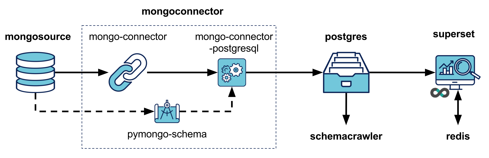

# Introduction
Are you trap in the MongoDB Analytics gap ? Looking for an open-source solution to analyze your MongoDB data ? 

Then this project is made for you ! It assembles a platform to perform SQL analytics on MongoDB data.  

Its core service is to synchronize data from MongoDB to PostgreSQL, applying a relational mapping in the process.

It also allows you to
- extract the schema of your MongoDB data, in markdown
- visualize the diagram of your new data schema in PostgreSQL
- explore and analyze your data with Superset, an open-source business intelligence web application  

  
# Quick start

Follow this steps : 
- Install [Docker]((https://docs.docker.com/engine/installation/)) (CE) & [Docker Compose](https://docs.docker.com/compose/install/) on your system.
- Download the project `git clone git@github.com:pajachiet/mongo_sql_analytics_platform.git`
- Download and install docker services `./run.sh install`. 
- Run demonstration `./run.sh demo`
- Connect to Superset at **localhost:8088**, with user **admin** and password **admin**. 

Under the hood, demonstration script will :

- Download json demonstration data, and ingest it in MongoDB database 'demo'
- Extract the schema of MongoDB data to `volumes/mongoconnector/data/schema_demo.md` file. Map this schema to a relational model in `mapping_demo.json` file.
- Synchronize data from MongoDB to PostgreSQL
- Import demonstration dashboards in Superset
- Extract a diagram of the relational data model to `volumes/sqlschema/data/sql_schema_demo.pdf` file

## Architecture 

This architecture has been exposed in a talk at PyParis 2017 **"Open-Source Analytics On MongoDB, with Schema"** : [youtube video](https://www.youtube.com/watch?v=J5Qn4r8nTpU), [slideshare](https://fr.slideshare.net/PoleSystematicParisRegion/opensource-analytics-stack-on-mongodb-with-schema-pierrealain-jachiet-and-aurlien-gervasi), [blog post](https://blog.octo.com/open-source-analytics-on-mongodb-with-schema/) (in french, although we could translate it if asked to)

### Services 

The architecture leverages Docker Compose, with the following services :
- **mongosource** : MongoDB database we want to analyze
- **mongoconnector** : Main service. It maps and synchronizes data between *mongosource* and *postgres*. See details on mongoconnector below. 
- **postgres** : Store MongoDB data, mapped to a relational model
- **superset** : Open-Source analytics web service, to demonstrate how MongoDB data can easily be analyzed once in postgres. 
- **redis** : Superset caching database
- **schemacrawler** : Create a diagram of PostgresSQL database 

### Details on mongoconnector service
**mongoconnector** is the main service of this platform. It leverages the following projects:
 
- [**mongo-connector**](https://github.com/mongodb-labs/mongo-connector), which sync data from a MongoDB database
- [**mongo-connector-postgresql**](https://github.com/Hopwork/mongo-connector-postgresql), a doc-manager to use PostgreSQL as the target DB of *mongo-connector*
- [**pymongo-schema**](https://github.com/pajachiet/pymongo-schema), to *extract* MongoDB data model, and *map* it to a relational model used by *mongo-connector-postgresql*

## Custom usage, with your own MongoDB data

### Install the platform

    ./run.sh install

### Read and edit variables in **'.env'** file  
  - Superset admin password and secret key to strong ones
  - Superset mapbox key, to draw maps in Superset

### Connect to your MongoDB data
#### option A : Connecting to an external MongoDB database

Edit MongoDB host and port in **'.env'** file.

Note : this is not easy yet to connect to a MongoDB running on host. See [TODO](#TODO)
  

#### option B : Using your own MongoDB data dump.

- Create a dump folder

    DB_NAME="mydb"
    mkdir -p volumes/mongosource/data/dump/${DB_NAME}

- Copy-Paste your data dump in this folder. This dump can either be a list of bson or json files.

- Restore data in mongosource

    ./run.sh restore

### Synchronize data in PostgreSQL

#### (optional) Edit namespaces.json
**'volumes/mongoconnector/conf/namespaces.json'** file should be edited using mongo-connector syntax for [Filtering Documents per Namespace](https://github.com/mongodb-labs/mongo-connector/wiki/Configuration-Options#filtering-documents-per-namespace). See also 'volumes/mongoconnector/namespaces_examples.json'.
 
This file is used twice

 - To list MongoDB databases to analyze
    - All databases in MongoDB if namespaces is empty (Default)
    - Databases present in at least one 'db.collection' namespaces otherwise (even if value is false)

 - Filtering collections and fields to map to PostgreSQL

#### Launch synchronization
**BEWARE** : mongoconnector service delete ALL DATA in target PostgreSQL databases.  

    ./run.sh connector
    
#### Look at your MongoDB data model
 
You may be interested to take a look at the data model extracted from your MongoDB data.

Read 'volumes/mongoconnector/data/schema_**DB_NAME**.md' file.

You can also check that your schema has been correctly filtered by 'namespaces.json', by looking at 'schema_filtered_**DB_NAME**.md' file.
    
    
#### Use Superset to analyze your data

    ./run.sh superset

This command will launch and initialize Superset.
 
To explore your data, you will have to
- create table (datasource)
- create slices (visualization)
- assemble slices into dashboards

Look at [Superset documentation](https://superset.incubator.apache.org/) for more information.
    
#### Extract a diagram of the relational data model
    

    ./run.sh schemacrawler <DB_NAME>

This command will extract a diagram of the relational data model of database <DB_NAME> to file `volumes/sqlschema/data/sql_schema_DB_NAME.pdf`    

# Contributing

If you use this architecture, please let us know.

Contributions are most welcomed to improve it. 

Github Issues and Pull-Requests will be greatly appreciated.

Please bear in mind that some issues may be related to specific projects used here. Those issues will find a better home in the corresponding github repositories.

## TODO

By decreasing priority order : 
 
- Publish pymongo-schema on PyPi and install it from there
- Set specific versions in requirements.txt files
- Allow to use MongoDB & PostgreSQL hosted on host system. We will need to 
    - tweak Docker network to connect on host databases
    - remove automatic dependency of mongoconnector to mongosource and postgres in docker-compose

- Improve mongoconnector scripts quality (function are too long, documentation is too sparse)
- Improve 'volumes/mongoconnector/namespaces_examples.json'
- Add functional tests. Automate them with travis

# Limitations

## Scaling 
The main limitation of this approach is that it cannot currently scale to very large MongoDB databases. 

- pymongo-schema could be improved to only scan part of the MongoDB database
- PostgreSQL can be tuned to improve interactive analytics (good resource [here](https://fr.slideshare.net/pgconf/five-steps-perform2009,
)), up to a certain point. Using PostreSQL extensions (CitusDB, PosgresXL or Greenplum) may be another solution. Or one should consider extending mongo-connector-postgresql to more general - sql alchemy compatible - doc manager. This would allow to synchronize data to a specialized analytics database.
 
## Data model evolution
With this solution, evolution of the data model in MongoDB is not automatically taken into account. One should extract again the data model, and restart synchronization from scratch. 
 
One improvement we made on a specific project where we use this solution was to directly extract MongoDB data model from the code of the application. This avoid to scan MongoDB data, and allows to restart synchronization just after the deployment of a new version of the application. Unfortunately this is specific to each project using MongoDB. And we will always need to restart synchronization from scratch to take into account evolutions of the data model.

# Contributors

This platform has been assembled by the following contributors
- @pajachiet
- @Webgardener
- @aureliengervasi
- @JulieRossi

# Acknowledgements

This platform assembles services from the following open-source projects. Big thanks to them !

- [mongo-connector](https://github.com/mongodb-labs/mongo-connector)
- [mongo-connector-postgresql](https://github.com/Hopwork/mongo-connector-postgresql)
- [pymongo-schema](https://github.com/pajachiet/pymongo-schema)
- [superset](https://github.com/apache/incubator-superset)